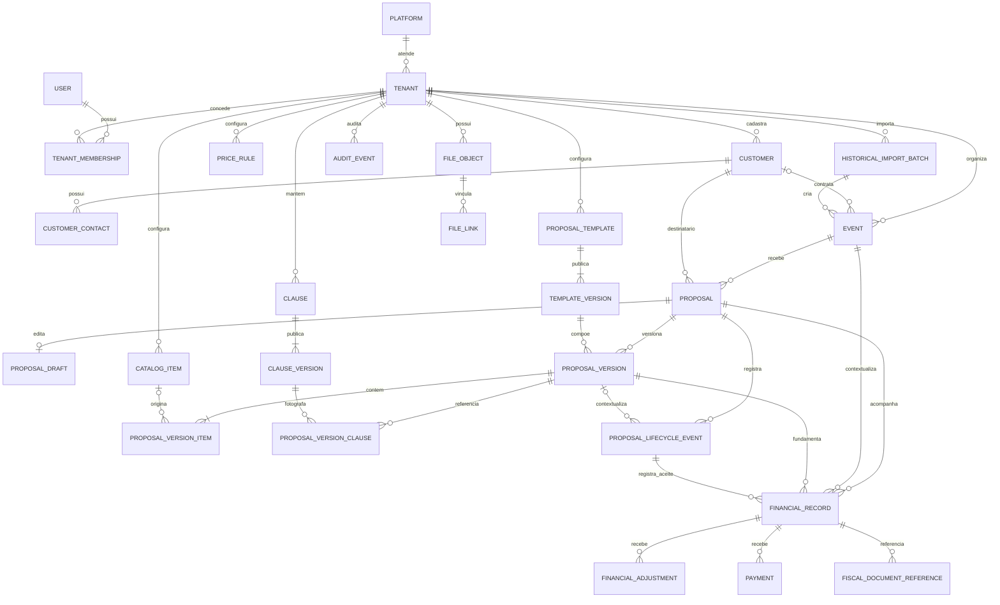

# Modelo de Dados e Fluxos — v0.2

Data: 22/08/2026

Status: modelo conceitual aprovado por Camila em 25/08/2026; esquema físico e hipóteses pendentes

Escopo: núcleo conceitual do futuro SaaS multiempresa e fluxos de Proposta, Evento e Financeiro

## 1. Finalidade e limites

Este documento consolida o modelo conceitual que deverá orientar a futura escolha de banco de dados e autenticação. Ele não escolhe fornecedor, não instala infraestrutura, não altera o protótipo, não migra o `localStorage`, não cria texto jurídico, não define tratamento tributário e não implementa PDF oficial.

As entidades e campos abaixo descrevem separações que o produto precisa preservar. Nomes físicos de tabelas, tipos do banco, índices, políticas de retenção e estados ainda marcados como proposta deverão ser validados antes da implementação.

## 2. Fontes consultadas

Foram usados como fontes primárias, na ordem de continuidade do projeto:

1. `00_LEIA-ME.md`;
2. `01_CONTEXTO_MESTRE_EQUIPESOM.md`;
3. `02_REGISTRO_DE_DECISOES.md`;
4. `03_ROADMAP_E_STATUS.md`;
5. `07_ESTADO_DO_PROJETO.json`;
6. `Blueprint_Produto_Orcamentos_v0.1.pdf`, especialmente as seções 5, 6, 7, 8 e 9;
7. `Inventario_Produto_Equipesom_v0.2.0.xlsx`, especialmente as abas `00_Resumo`, `02_Propostas`, `04_Precos_Regras`, `05_Eventos_Excecoes`, `06_Clausulas`, `07_Acesso_Arquitetura`, `09_Pendencias`, `10_Dicionario_MVP` e `13_Inventario_Inicial`;
8. decisões confirmadas diretamente por Camila nesta conversa em 22/08/2026.

Evidências que limitam este modelo:

- a aba `02_Propostas` declara que valores históricos servem apenas para comparação e não constituem tabela oficial;
- a aba `13_Inventario_Inicial` declara que a lista está incompleta e que ausência na lista não significa indisponibilidade;
- a aba `06_Clausulas` declara que nenhum texto deve ser publicado como cláusula definitiva sem revisão profissional e controle de versão;
- a aba `04_Precos_Regras` mantém o tratamento tributário como pendência crítica da contabilidade;
- o Blueprint v0.1 é uma base de descoberta e validação, não uma arquitetura física aprovada.

## 3. Decisões confirmadas nesta versão

1. EQUIPESOM será a primeira empresa cliente do futuro SaaS; não será a marca da plataforma.
2. A marca do SaaS permanece indefinida.
3. Para a EQUIPESOM, o desconto será informado em percentual e calculado sobre o subtotal anterior ao desconto.
4. A versão da proposta guardará o percentual e o valor monetário calculado do desconto.
5. Eventos existirão independentemente de propostas.
6. Será possível cadastrar eventos realizados antes do sistema ou fora dele.
7. O calendário distinguirá o estado do evento do estado das propostas relacionadas.
8. Uma proposta aceita originará acompanhamento financeiro.
9. Valor proposto, valor aceito, valor final executado, ajustes e pagamentos permanecerão separados.
10. O sistema oferecerá relatório financeiro anual de apoio, sem apresentá-lo como declaração tributária.
11. A proposta suportará pelo menos três cláusulas; esta é uma capacidade do modelo, não autorização para publicar textos nem obrigação de selecionar exatamente três.
12. Pagamento, cancelamento/remarcação e responsabilidades sobre energia, acesso e segurança são temas candidatos a cláusulas, ainda sujeitos às pendências documentadas e às revisões aplicáveis.

## 4. Princípios de modelagem

- Todo registro de negócio pertencente a uma empresa deverá conter `tenant_id` e ser autorizado no servidor; filtro na interface não é isolamento.
- A plataforma, a empresa cliente, a identidade da pessoa e o vínculo dessa pessoa com uma empresa são conceitos separados.
- Cadastro atual e fotografia histórica são conceitos separados. Uma versão imutável não depende de alterações futuras em cliente, emitente, catálogo, modelo ou cláusula.
- O rascunho é uma área de trabalho editável. Uma versão da proposta é uma fotografia imutável criada no marco definido para versionamento, especialmente na emissão.
- Emissão, envio, assinatura do fornecedor, aceite, recusa, contrato e ordem de serviço são eventos distintos.
- Dados estruturados, regras comerciais, conteúdo jurídico, modelo visual e arquivos renderizados permanecem separados.
- O calendário será uma projeção de dados de eventos e propostas, não a fonte única do estado de nenhum dos dois.
- Valores financeiros serão monetários com moeda explícita e precisão controlada; regras de arredondamento ainda precisam ser aprovadas.
- Dados de demonstração e importações históricas manterão origem e nível de confiança; não serão promovidos silenciosamente a dados oficiais.

## 5. Diagrama de entidades



O diagrama é conceitual. `FILE_LINK`, projeções do calendário e fotografias podem ser implementados com tabelas relacionais, estruturas JSON validadas ou combinação das duas, desde que integridade, isolamento e imutabilidade sejam demonstráveis.

## 6. Entidades e campos principais

Campos de auditoria comuns, salvo exceção: `created_at`, `created_by_user_id`, `updated_at` e, quando aplicável, `archived_at`. Identificadores internos não devem expor sequência previsível como mecanismo de autorização.

| Entidade | Campos principais | Regra de escopo e integridade |
|---|---|---|
| Plataforma | `platform_id`, `platform_brand_name` opcional, `default_locale`, `created_at` | Não representa uma empresa usuária. A marca permanece vazia até decisão de Camila. |
| Empresa / tenant | `tenant_id`, marca comercial, razão social, documento, endereço, contatos, configurações | Cada empresa cliente possui cadastro e configurações próprios. EQUIPESOM é o primeiro tenant. |
| Usuário | `user_id`, identidade de login, nome exibido, estado da conta | Pessoa independente do tenant; não contém papel global por suposição. |
| Vínculo | `membership_id`, `tenant_id`, `user_id`, `role_id`, estado, vigência | Autoriza atuação explícita dentro de um tenant; uma pessoa pode ter mais de um vínculo. |
| Papel / permissão | `role_id`, `tenant_id` opcional, permissões, versão da política | Perfis e limites por empresa permanecem configuráveis; sem senha compartilhada. |
| Cliente | `customer_id`, `tenant_id`, tipo, nome/razão social, documento, endereços, estado do cadastro | Contratante separado do tenant emitente; documento validado conforme tipo. |
| Contato do cliente | `contact_id`, `tenant_id`, `customer_id`, nome, telefone, e-mail, função, autorização conhecida | A autorização para aceitar não deve ser inferida apenas pelo cadastro do contato. |
| Evento | `event_id`, `tenant_id`, `customer_id` opcional, nome, tipo, períodos, local, contexto, `event_status`, origem | Existe sem proposta; aceita cadastro histórico e origem externa. |
| Lote de importação histórica | `import_batch_id`, `tenant_id`, fonte, arquivo/hash, data, responsável, resultado, contagens | Preserva proveniência, permite repetição idempotente e relatório de inconsistências. |
| Catálogo | `catalog_item_id`, `tenant_id`, tipo equipamento/serviço, categoria, nome interno, descrição comercial, unidade, estado do dado | Catálogo comercial não comprova propriedade nem disponibilidade física. |
| Ativo físico futuro | `asset_id`, `tenant_id`, `catalog_item_id`, identificação, propriedade, condição, estado operacional | Fora do escopo atual; necessário antes de qualquer disponibilidade real. |
| Regra de preço | `price_rule_id`, `tenant_id`, contexto, vigência, unidade, valor sugerido, prioridade, justificativa | Sugere preço; não substitui valor negociado nem reescreve histórico. |
| Proposta | `proposal_id`, `tenant_id`, `customer_id`, `event_id`, número oficial opcional, estado atual, versão vigente opcional | Identidade da negociação. Pode existir apenas com rascunho e zero versões emitidas. O formato confirmado do número é `EQ-AAAA-NNNN` para a EQUIPESOM. |
| Rascunho da proposta | `proposal_draft_id`, `tenant_id`, `proposal_id`, dados editáveis, etapa, revisão, última gravação | Área mutável, sem emissão. Não deve ser confundida com versão histórica. |
| Versão da proposta | `proposal_version_id`, `tenant_id`, `proposal_id`, número da versão, fotografias das partes/evento, `template_version_id`, valores, condições, `created_at`, `issued_at`, hash de conteúdo | Fotografia imutável criada na emissão. A Proposta possui zero versões antes da primeira emissão e acumula uma ou mais versões depois das emissões; versão emitida nunca é atualizada. |
| Item da versão | `proposal_version_item_id`, `tenant_id`, `proposal_version_id`, origem opcional do catálogo, tipo, descrição exibida, quantidade, unidade, preço unitário opcional, subtotal, ordem, observações | Guarda o texto e os valores apresentados, sem depender do catálogo atual. |
| Modelo de proposta | `template_id`, `tenant_id`, nome, finalidade, estado | Identidade configurável do modelo; separado da versão publicada. |
| Versão do modelo | `template_version_id`, `tenant_id`, `template_id`, blocos, ordem, regras visuais, ativos, estado de publicação, vigência | Publicação cria versão; alteração não modifica documentos históricos. |
| Cláusula | `clause_id`, `tenant_id`, tema, finalidade, estado | Identidade do tema, sem texto definitivo por si só. |
| Versão da cláusula | `clause_version_id`, `tenant_id`, `clause_id`, texto, fonte, revisão jurídica, revisor, data, vigência, estado | Somente texto com fonte e revisão registrada poderá ser publicado. |
| Cláusula da versão | `proposal_version_clause_id`, `tenant_id`, `proposal_version_id`, `clause_version_id`, ordem, texto fotografado | A proposta deverá suportar três ou mais referências, sem inventar conteúdo. |
| Evento do ciclo da proposta | `proposal_event_id`, `tenant_id`, `proposal_id`, `proposal_version_id` condicional, tipo, instante, ator, destinatário, canal, motivo, evidência | A versão é obrigatória para emissão, envio, assinatura do fornecedor, aceite, recusa de uma versão e expiração de uma versão; só pode ser omitida quando o evento realmente independer de documento específico. |
| Registro financeiro | `financial_record_id`, `tenant_id`, `proposal_id`, `event_id`, `accepted_proposal_version_id`, `acceptance_event_id`, moeda, valor proposto, `accepted_amount_snapshot`, `accepted_at`, valor final executado, estado, datas de referência | Criado a partir do aceite e vinculado à versão e ao evento de aceite exatos. A quantidade de registros por negociação permanece hipótese; valores fotografados e posteriores permanecem separados. |
| Ajuste financeiro | `financial_adjustment_id`, `tenant_id`, `financial_record_id`, tipo, valor, motivo, instante, aprovador | Não sobrescreve valor proposto, aceito ou executado. |
| Pagamento / recebimento | `payment_id`, `tenant_id`, `financial_record_id`, valor, data, meio opcional, referência, estado, evidência | Cada recebimento é individual; total pago é derivado da soma válida. |
| Referência fiscal | `fiscal_reference_id`, `tenant_id`, `financial_record_id`, tipo, número externo, data, situação informada, `file_object_id` opcional | Referência documental, não cálculo tributário nem declaração fiscal. |
| Arquivo em objeto | `file_object_id`, `tenant_id`, chave do objeto, nome original, MIME, tamanho, hash, classificação, retenção, estado | Binário em armazenamento de objetos; banco guarda metadados e acesso. |
| Vínculo de arquivo | `file_link_id`, `tenant_id`, `file_object_id`, tipo de entidade, identificador da entidade, finalidade | A forma física deverá garantir que o alvo pertença ao mesmo tenant. |
| Auditoria | `audit_event_id`, `tenant_id`, ator, ação, entidade, identificador, instante, motivo, correlação, resumo antes/depois | Registro acrescentado, não editável pelo fluxo comum; dados sensíveis devem ser minimizados. |

## 7. Proposta, rascunho e versão imutável

### 7.1 Separação

- `Proposal` mantém a identidade da negociação e o estado atual.
- `ProposalDraft` mantém a composição em edição e pode ser salva diversas vezes.
- Uma `Proposal` recém-criada pode manter somente seu `ProposalDraft`, sem qualquer `ProposalVersion` emitida.
- A primeira emissão cria a primeira `ProposalVersion`; emissões posteriores acrescentam novas versões, de modo que a relação passa de zero para uma ou mais versões sem substituir as anteriores.
- `ProposalVersion` é uma fotografia imutável numerada. Toda emissão referencia a versão específica que criou, e nenhuma versão emitida pode ser editada.
- Uma alteração depois da emissão cria novo rascunho baseado na versão anterior e, quando concluída, uma nova versão; nunca edita a versão emitida.
- Cliente, emitente, evento, elaborador, itens, valores, condições, modelo e cláusulas usados devem ser fotografados na versão.

### 7.2 Memória do desconto da EQUIPESOM

Para o tenant EQUIPESOM:

```text
desconto_valor = arredondar(subtotal_antes_desconto × desconto_percentual ÷ 100)
total_proposto = subtotal_antes_desconto - desconto_valor
```

A versão deve guardar, no mínimo:

- `subtotal_before_discount`;
- `discount_percentage`;
- `discount_amount` calculado;
- `proposed_total`;
- `currency`;
- componentes que formaram o subtotal;
- identificador da regra/fórmula utilizada;
- usuário que informou o percentual e, quando exigido, quem autorizou;
- instante da autorização e justificativa, conforme política da empresa.

Permanecem pendentes a precisão de arredondamento, o intervalo permitido, o tratamento de acréscimos e a política de autorização além da regra já confirmada de Edevaldo para a EQUIPESOM. Essas definições não devem virar regra global do SaaS.

## 8. Modelos e cláusulas versionadas

- Modelo e versão do modelo são entidades diferentes.
- Uma versão de proposta referencia exatamente uma versão publicada do modelo.
- Cláusula e versão da cláusula são entidades diferentes.
- A capacidade mínima é associar pelo menos três cláusulas distintas a uma versão, mantendo ordem e fotografia do texto.
- Não há texto jurídico aprovado neste documento.
- Os temas pagamento, cancelamento/remarcação, energia, acesso e segurança permanecem candidatos; fonte, redação, aplicação e exceções dependem de revisão.
- Propostas antigas continuam ligadas às versões de modelo, cláusulas e ativos usados na ocasião.

## 9. Eventos do ciclo comercial

O histórico comercial será acrescentado como eventos, com ator, instante, versão e evidência quando aplicável. Em `ProposalLifecycleEvent`, `proposal_version_id` é obrigatório para emissão, envio, assinatura do fornecedor, aceite, recusa de uma versão e expiração de uma versão, pois todos dependem de um documento específico. O campo só poderá ser opcional quando o evento realmente não depender de versão.

Esta versão do modelo não define a obrigatoriedade para cancelamentos gerais nem para outros eventos ainda pendentes. Esses casos deverão permanecer explícitos e ser decididos antes da implementação, sem herdar por suposição a regra dos eventos vinculados a documento.

| Tipo | O que registra | Não significa |
|---|---|---|
| Emissão | criação da versão final imutável e, futuramente, do documento correspondente | envio ao cliente ou aceite |
| Envio | entrega/compartilhamento de uma versão a um destinatário por um canal | leitura, aceite ou assinatura |
| Assinatura do fornecedor | autoria ou aprovação do lado fornecedor, vinculada à versão | aceite do cliente |
| Aceite | manifestação do cliente sobre uma versão exata, com pessoa e evidência | contrato assinado ou execução autorizada em todo cenário |
| Recusa de uma versão | manifestação negativa sobre uma versão exata, com motivo quando disponível | cancelamento do evento |
| Expiração de uma versão | término da validade de uma versão exata sem aceite vigente | recusa expressa |
| Cancelamento | encerramento registrado com motivo e política aplicável | exclusão do histórico |

## 10. Estados e transições

Os nomes abaixo combinam o Blueprint v0.1 com as novas separações. Apenas as regras explicitamente marcadas como confirmadas estão aprovadas; os demais estados são uma proposta para validação de Camila.

### 10.1 Proposta

| Estado | Transições de entrada sugeridas | Transições de saída sugeridas | Situação |
|---|---|---|---|
| Rascunho | criação ou nova negociação baseada em versão anterior | em revisão, cancelada | Base documentada; detalhes pendentes. |
| Em revisão | envio interno para conferência | rascunho, aprovada internamente, cancelada | Proposto no Blueprint. |
| Aprovada internamente | aprovação por pessoa autorizada | emitida, rascunho | Proposto no Blueprint. |
| Emitida | evento distinto de emissão de versão imutável | enviada, expirada, cancelada | Imutabilidade confirmada; transições pendentes. |
| Enviada | evento distinto de envio | em negociação, aceita, recusada, expirada, cancelada | Separação do envio confirmada. |
| Em negociação | pedido de alteração | rascunho para nova versão, aceita, recusada | Proposto; detalhamento pendente. |
| Aceita | evento de aceite da versão | contrato pendente ou fluxo configurado | Confirmado: origina acompanhamento financeiro. Não libera automaticamente evento público. |
| Recusada / Expirada / Cancelada | evento correspondente | reabertura somente por novo fluxo auditado | Motivos e reabertura pendentes. |

### 10.2 Evento

| Estado sugerido | Transições sugeridas | Observação |
|---|---|---|
| Cadastrado | planejado, realizado, cancelado | Permite importar evento histórico diretamente como realizado. |
| Planejado | confirmado, remarcado, cancelado | Não depende do estado de proposta. |
| Confirmado | em execução, remarcado, cancelado | Confirmação operacional não deve ser inferida apenas do aceite comercial. |
| Em execução | realizado, interrompido | Estado proposto; critérios operacionais pendentes. |
| Realizado | ajuste histórico auditado | Estado final normal; admite data anterior ao sistema. |
| Remarcado | planejado ou confirmado com novos períodos | Deve preservar períodos anteriores e motivo. |
| Cancelado / Interrompido | encerrado ou novo evento relacionado | Consequências comerciais e jurídicas permanecem pendentes. |

Os nomes e gatilhos dos estados de Evento ainda não foram confirmados por Camila; são uma proposta de trabalho para que o calendário não misture execução com negociação.

### 10.3 Financeiro

| Estado sugerido | Transições sugeridas | Regra |
|---|---|---|
| A iniciar | criado após aceite | a receber, encerrado por correção auditada | Criação após aceite confirmada. |
| A receber | registro financeiro ativado | parcial, quitado, em atraso, cancelado | Vencimento e critérios de atraso dependem das regras aprovadas. |
| Parcial | recebimento inferior ao saldo | parcial, quitado, em atraso | Pagamentos permanecem registros separados. |
| Quitado | saldo calculado igual a zero | reaberto apenas por ajuste auditado | Critério técnico proposto. |
| Em atraso | saldo aberto após vencimento | parcial, quitado, renegociado | Consequências por atraso estão pendentes. |
| Cancelado / Encerrado | decisão registrada | ajuste auditado, se necessário | Não apaga pagamentos, ajustes ou evidências. |

Os nomes finais, vencimento, renegociação, competência e reconhecimento financeiro dependem de Camila, Edevaldo e contabilidade.

## 11. Calendário

O calendário deverá apresentar, no mesmo período, fontes distintas:

- Evento: nome, períodos, local e `event_status`.
- Proposta relacionada: número/identificador, versão vigente e `proposal_status`.
- Financeiro, quando autorizado para o perfil: vencimentos e estado financeiro, sem substituir o evento.

Regras:

- um evento aparece mesmo sem proposta;
- um evento histórico pode aparecer como realizado, com selo de origem importada;
- várias propostas podem ser relacionadas a um evento sem fundir seus estados;
- cor, ícone e texto devem indicar se o estado pertence ao Evento, à Proposta ou ao Financeiro;
- filtros do calendário não alteram os estados de origem.

## 12. Acompanhamento financeiro e relatório anual

O aceite origina acompanhamento financeiro. Cada `FinancialRecord` deve se vincular à Proposta e ao Evento como contexto, mas esses vínculos não são suficientes: também deve registrar `accepted_proposal_version_id`, `acceptance_event_id`, `accepted_amount_snapshot` e `accepted_at`.

O `acceptance_event_id` deve apontar para o evento de aceite da mesma versão, Proposta e `tenant_id`. O vínculo com `accepted_proposal_version_id` preserva o valor e as condições da versão efetivamente aceita, mesmo que a negociação receba versões posteriores. O valor aceito e a data do aceite são fotografados no registro financeiro e não podem ser recalculados a partir do estado atual da Proposta.

A quantidade de registros financeiros não está definida nesta versão. Permanece como hipótese a validar se o acompanhamento será único por Proposta, por aceite ou por ciclo de contratação. Independentemente da cardinalidade escolhida, a separação mínima é:

- valor proposto: total da versão apresentada e aceita;
- valor aceito: montante confirmado no aceite e fotografado em `accepted_amount_snapshot`;
- valor final executado: valor consolidado depois da execução, ainda que igual ao aceito;
- ajustes: lançamentos positivos ou negativos com motivo e aprovação;
- pagamentos/recebimentos: transações individuais com data e evidência;
- saldo: cálculo derivado, nunca campo que apaga o histórico.

O relatório anual será material de apoio operacional. Deverá exibir período, critérios, origem dos registros, totais e ressalva explícita de que não constitui declaração tributária, escrituração contábil ou orientação fiscal. A base temporal do relatório — competência do evento, aceite, vencimento ou pagamento — permanece pendente de validação contábil.

## 13. Documentos fiscais como referência

O sistema poderá guardar metadados e arquivo de referência de nota, recibo ou outro documento informado, sem calcular tributos nem concluir obrigações. Tipos aceitos, campos obrigatórios, integração, retenção, cancelamento e significado contábil dependem de validação da contabilidade.

Nenhuma ausência de referência fiscal poderá ser apresentada como isenção, dispensa ou regularidade tributária.

## 14. Arquivos e PDFs em armazenamento de objetos

- Banco relacional guarda metadados, vínculos, hash, classificação, política de acesso e retenção.
- Logotipos, imagens, anexos, evidências e PDFs ficam em armazenamento de objetos isolado por tenant.
- Chaves de objetos não podem ser autorização; o acesso precisa ser validado e temporário.
- PDF futuro pertence a uma `ProposalVersion` específica, com hash e instante de geração.
- Regeneração não substitui silenciosamente o PDF histórico; novo arquivo ou nova versão deve ser rastreável.
- Arquivos suspeitos, incompatíveis ou sem vínculo válido ficam em quarentena.

PDF oficial, assinatura e escolha do provedor de objetos permanecem fora desta etapa.

## 15. Auditoria

Auditar, no mínimo:

- criação e alteração de cadastros relevantes;
- mudança de preço e desconto, incluindo antes/depois, motivo e autorizador;
- criação, revisão e emissão de versão;
- envio, assinatura do fornecedor, aceite, recusa, expiração e cancelamento;
- criação e alteração de acompanhamento financeiro, ajustes e pagamentos;
- vínculo ou remoção lógica de arquivos;
- importações, rejeições e correções de dados históricos;
- mudança de vínculo, papel e permissão.

O log comum não deve permitir exclusão ou edição pelos mesmos fluxos de negócio. Retenção, anonimização e acesso a dados pessoais ainda precisam de política jurídica e de privacidade.

## 16. Isolamento obrigatório por `tenant_id`

Requisitos mínimos:

1. todas as entidades de negócio carregam `tenant_id` diretamente ou por relação obrigatória verificável;
2. chaves únicas comerciais incluem `tenant_id`, como número de proposta e nomes configuráveis quando aplicável;
3. consultas, gravações, arquivos, tarefas e relatórios validam o tenant no servidor;
4. um vínculo de usuário ativo é necessário para atuar no tenant;
5. referências cruzadas entre tenants são rejeitadas pelo serviço e, quando suportado, pelo banco;
6. testes automatizados tentam leitura, alteração, enumeração e download entre tenants;
7. auditoria registra o tenant e a identidade efetiva;
8. exportação e exclusão seguem escopo de tenant e política de retenção.

## 17. Importação de eventos históricos sem proposta

Fluxo recomendado:

1. criar `HistoricalImportBatch` com fonte, responsável, data e hash;
2. validar formato e separar linhas válidas, incompletas e incompatíveis;
3. exigir `tenant_id` de destino explícito;
4. criar Evento com `source_type = historical_import`, data original, estado informado e `occurred_before_system` quando aplicável;
5. manter cliente opcional ou criar vínculo somente após identificação segura;
6. não criar Proposta, Versão ou Financeiro quando a fonte não comprovar esses dados;
7. registrar qualidade, campos ausentes e referência à origem;
8. produzir relatório de importação e permitir correção auditada sem apagar o conteúdo bruto.

Eventos simulados do protótipo não entram nesse fluxo como fatos operacionais.

## 18. Riscos de migrar diretamente do `localStorage`

| Risco | Consequência | Controle recomendado |
|---|---|---|
| Conteúdo alterável pela pessoa ou pelo navegador | dado pode não representar fato ocorrido | tratar como fonte não confiável e exigir validação |
| Formatos `v1` a `v4` e registros incompletos | perda, duplicação ou interpretação incorreta | normalização versionada e relatório por registro |
| Mistura de demonstrativos e rascunhos reais | números fictícios podem virar operação oficial | classificar origem e bloquear promoção automática |
| Ausência de transações | proposta e versão podem ficar parcialmente migradas | importar em transação por unidade lógica |
| Identificadores locais e colisões | referências podem apontar para registros errados | mapa de identificadores e chaves idempotentes |
| Ausência de identidade autenticada | autoria não pode ser comprovada | marcar ator como legado não verificado até reconciliação |
| Datas do dispositivo | ordem e fuso podem estar incorretos | guardar valor original, fuso informado e data de importação |
| Sem backup ou concorrência | dados podem sumir ou divergir entre navegadores | exportação preservada, checksum e reconciliação manual |
| Fotografias parciais | histórico não pode ser completado com segurança | não fabricar dados de versões enviadas, aceitas ou demonstrativas |
| Sem controle de tenant no servidor | risco de associação ao tenant errado | destino explícito e validação cruzada em cada entidade |

## 19. Proposta de migração dos dados simulados e locais

1. Congelar e exportar uma cópia bruta das chaves conhecidas, sem apagá-las.
2. Calcular hash e registrar navegador, data, formato e tenant declarado.
3. Classificar cada registro como `demonstration`, `local_draft_candidate`, `incompatible` ou `unknown`.
4. Executar simulação de importação sem gravação oficial e apresentar o relatório a Camila.
5. Migrar demonstrativos somente para um ambiente ou namespace de demonstração, nunca para indicadores oficiais.
6. Migrar rascunhos candidatos somente após confirmação explícita, como rascunhos editáveis e com origem `prototype_local_storage`.
7. Não transformar rascunho em versão emitida, aceite, financeiro ou evento realizado.
8. Preservar o identificador local em `legacy_reference` e gerar novos identificadores internos.
9. Usar chave idempotente por tenant, origem, formato e identificador legado para evitar duplicação.
10. Colocar dados incompatíveis em quarentena com motivo, sem exclusão silenciosa.
11. Reconciliar contagens, valores, vínculos e datas antes de encerrar a migração.
12. Manter exportação bruta e relatório conforme política de retenção ainda a definir.

## 20. Requisitos para futuro banco e autenticação

Esta comparação define capacidades a avaliar; não seleciona produto.

| Dimensão | Banco de dados deverá atender | Autenticação deverá atender | Evidência objetiva na avaliação |
|---|---|---|---|
| Multiempresa | isolamento por `tenant_id`, integridade entre relações e possibilidade de políticas adicionais no banco | sessão associada a usuário e vínculos de tenant, com troca explícita de contexto | teste automatizado de acesso cruzado falha em leitura e escrita |
| Consistência | transações, chaves únicas por tenant, relações e controle de concorrência | criação/revogação consistente de sessões e vínculos | testes de emissão concorrente, duplicidade e revogação |
| Versionamento | migrações de esquema rastreáveis e recuperação compatível | mudanças de configuração e identidade auditáveis | ambiente de teste migra e volta por procedimento documentado |
| Auditoria | timestamps confiáveis, escrita acrescentada e consulta por correlação | eventos de login, falha, MFA, recuperação e revogação | trilha completa sem senha, token ou dado excessivo |
| Segurança | criptografia em trânsito e repouso, segredos fora do código, menor privilégio | senhas seguras ou federação, MFA disponível, proteção contra abuso, sessões revogáveis | revisão de configuração e testes de sessão/recuperação |
| Backup | backup automático, restauração testada e objetivos de perda/tempo definidos | exportação ou recuperação de configuração e usuários conforme contrato | teste real de restauração em ambiente isolado |
| Arquivos | referências consistentes ao armazenamento de objetos e autorização no servidor | acesso a arquivos condicionado ao usuário e tenant | URL temporária não funciona para outro tenant ou após expiração |
| Relatórios | consultas relacionais, agregações anuais e desempenho previsível | autorização por papel para dados financeiros | relatório reproduzível com filtros e totais conciliados |
| Portabilidade | exportação em formatos abertos, documentação de esquema e estratégia de saída | exportação de identidades/vínculos permitidos e desacoplamento do domínio | exercício de exportação sem dependência exclusiva não documentada |
| Operação | observabilidade, limites, manutenção, ambiente local/teste e custos compreensíveis | disponibilidade, suporte, limites, logs e ambientes separados | matriz de custos e operação com cenário piloto e crescimento |
| Privacidade | região, retenção, exclusão/anônimo quando aplicável e contrato compatível | minimização, recuperação segura e controles de dados pessoais | revisão jurídica/LGPD antes de produção |

Critérios eliminatórios recomendados para a futura avaliação:

- não demonstrar isolamento real entre tenants;
- depender de senha compartilhada;
- não oferecer restauração testável;
- impedir auditoria dos eventos críticos;
- não suportar transações para emissão, numeração e financeiro;
- não permitir estratégia documentada de exportação e saída.

Permanecem pendentes antes da escolha: volume esperado, orçamento, região de dados, objetivos de recuperação, equipe responsável pela operação, necessidade de serviço gerenciado, método de autenticação do piloto e política de privacidade/retenção.

## 21. Regras confirmadas, hipóteses e pendências

### 21.1 Confirmado

- EQUIPESOM é o primeiro tenant e não a marca da plataforma.
- SaaS multiempresa com isolamento por `tenant_id`.
- usuários, empresas e vínculos separados; sem senha compartilhada.
- eventos independentes e importáveis sem proposta.
- proposta e versão separadas; versões emitidas imutáveis.
- desconto percentual da EQUIPESOM sobre subtotal anterior, com percentual e valor guardados.
- emissão, envio, assinatura do fornecedor, aceite, recusa de uma versão e expiração de uma versão são eventos separados e obrigatoriamente vinculados à versão exata.
- aceite origina acompanhamento financeiro.
- acompanhamento financeiro referencia a versão aceita e o evento de aceite exatos, com valor aceito e data fotografados.
- valores proposto, aceito, final executado, ajustes e pagamentos separados.
- relatório anual apenas de apoio.
- capacidade para pelo menos três cláusulas, sem texto inventado.
- objetos binários fora do banco relacional e metadados no banco.

### 21.2 Hipóteses de desenho a validar

- nomes exatos e gatilhos dos estados de Evento e Financeiro;
- existência de uma única área de rascunho ativa por Proposta;
- forma física das fotografias, como colunas estruturadas e/ou JSON validado;
- cardinalidade do acompanhamento financeiro: um registro por Proposta, por aceite ou por ciclo de contratação;
- projeção do calendário e cores/ícones usados;
- fluxo de reabertura depois de recusa, expiração ou cancelamento;
- critérios de arredondamento monetário e tratamento de acréscimos;
- forma física de vínculos polimórficos de arquivos.

### 21.3 Decisões pendentes de Camila e operação

- marca e domínio da plataforma SaaS;
- estados finais, nomes visíveis e regras de reabertura;
- papéis e usuários reais do piloto;
- como várias propostas do mesmo evento aparecem e qual pode ser aceita;
- quais dados históricos locais merecem migração como rascunho;
- campos e filtros do relatório anual;
- regras operacionais de eventos confirmados, remarcados, cancelados e realizados;
- reconciliação do inventário antes de qualquer disponibilidade.

### 21.4 Pendências jurídicas

- texto e aplicação das cláusulas de pagamento, cancelamento/remarcação, energia, acesso e segurança;
- forma de aceite, poderes do aceitante e evidências necessárias;
- contratos, ordem de serviço, retenção, privacidade e tratamento de anexos;
- consequências de atraso, força maior, danos, perdas e exceções.

### 21.5 Pendências contábeis

- tratamento tributário e significado dos documentos fiscais;
- regime temporal do relatório anual e conciliação com registros oficiais;
- campos, retenção e cancelamento de referências fiscais;
- classificação de ajustes, recebimentos, estornos e valores executados;
- limites da apresentação do relatório para que não pareça declaração tributária.

## 22. Critérios de aceite para Camila

Camila poderá considerar esta versão compreendida e apta para orientar a próxima etapa quando confirmar, em linguagem de negócio, que:

- [ ] EQUIPESOM aparece como primeira empresa cliente, e a plataforma continua sem marca definida.
- [ ] Uma pessoa possui identidade própria e só acessa uma empresa por vínculo autorizado.
- [ ] Cliente, contato, evento, proposta e versão são cadastros diferentes.
- [ ] É possível registrar um evento antigo ou atual sem criar proposta.
- [ ] O calendário mostra separadamente a situação do evento e das propostas.
- [ ] Uma proposta recém-criada pode ter apenas um rascunho e nenhuma versão; a primeira emissão cria a primeira versão, e nenhuma versão emitida pode ser alterada.
- [ ] O desconto da EQUIPESOM parte de um percentual e guarda também o valor calculado.
- [ ] Emitir, enviar, assinar como fornecedor, aceitar, recusar uma versão e deixar uma versão expirar criam registros diferentes e apontam para a versão exata.
- [ ] Uma proposta aceita abre acompanhamento financeiro vinculado à versão e ao evento de aceite exatos, preservando o valor aceito e a data mesmo quando surgirem versões posteriores.
- [ ] Continua pendente decidir se haverá um acompanhamento financeiro por proposta, por aceite ou por ciclo de contratação.
- [ ] Pagamentos e ajustes não apagam nem substituem os valores anteriores.
- [ ] O relatório anual está claramente identificado como apoio, não declaração fiscal.
- [ ] O sistema suporta três ou mais cláusulas, mas não contém redação jurídica inventada.
- [ ] PDFs, fotos e anexos ficam fora do banco, com acesso controlado e referência auditável.
- [ ] Nenhum dado demonstrativo do protótipo vira dado oficial sem revisão.
- [ ] Banco e autenticação serão escolhidos por testes e requisitos, não por preferência presumida.

## 23. Saída esperada desta versão

Após a revisão de Camila, o próximo documento deverá registrar:

1. itens aprovados sem alteração;
2. correções de linguagem e fluxo;
3. decisões sobre hipóteses prioritárias;
4. pendências que bloqueiam banco, autenticação ou migração;
5. matriz de avaliação preenchida com candidatos reais, evidências, custos e riscos, antes de qualquer escolha.

## Registro da versão

| Versão | Data | Alteração |
|---|---|---|
| 0.2 | 22/08/2026 | Primeira consolidação do modelo conceitual e dos fluxos de Proposta, Evento e Financeiro, incluindo decisões confirmadas por Camila nesta conversa. |
| 0.2 | 25/08/2026 | Aprovação conceitual por Camila, sem aprovação de fornecedor, esquema físico definitivo, hipóteses e estados pendentes, textos jurídicos, tratamento contábil ou tributário, disponibilidade de equipamentos ou migração/oficialização de dados do `localStorage`. |
